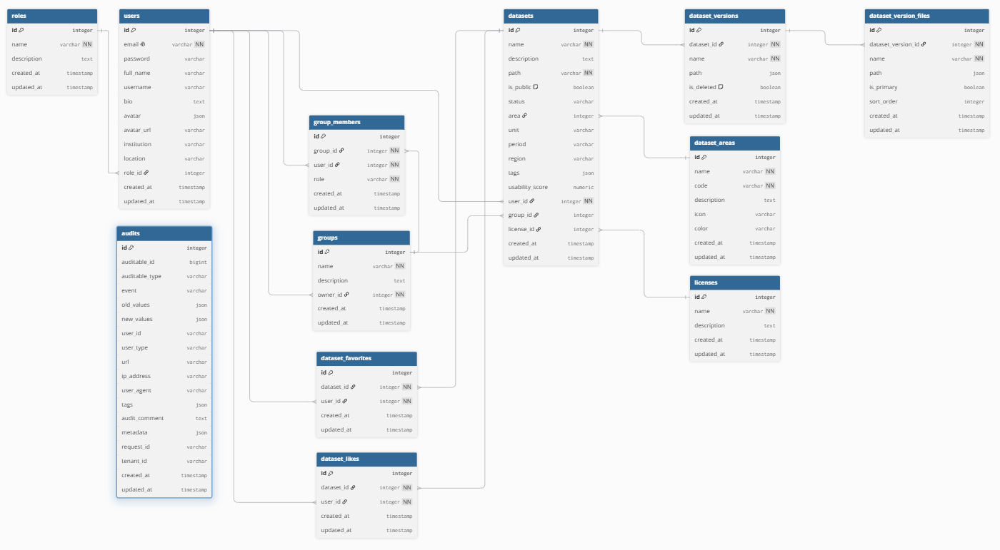

<h1 style="text-align: center; font-size: 2.5rem; color: #284b8c">Documento de Banco de Dados</h1>
<h2 style="text-align: center; font-size: 2rem; color: #284b8c">DataRural</h2>

# Registro de Revisões
| Versão |    Data    |    Notas de revisão     | Responsável |
| :----: | :--------: | :---------------------: | :---------: |
|  1.0   | 04/04/2026 | Elaboração do Documento |   Rafael    |
|  2.0   | 05/08/2026 | Atualização conforme implementação atual |   Rafael    |

<!--# Sumário
- [[#1. Introdução|1 Introdução]]
	- [[#1.1 Objetivo|1.1 Objetivo]]
	- [[#1.2 Definições, acrônimos e abreviações|1.2 Definições, acrônimos e abreviações]]
- [[#2. Premissas|2 Premissas]]
- [[#3. Definição de Escopo|3. Definição de Escopo]]
	- [[#3.1 Dentro do Escopo|3.1 Dentro do Escopo]]
	- [[#3.2 Fora de Escopo|3.2 Fora de Escopo]]
- [[#4. Modelo Entidade Relação|4. Modelo Entidade Relação]]
- [[#5. Dicionário de Dados|5. Dicionário de Dados]]
	- [[#5.1 Tabela users|5.1 Tabela users]]
	- [[#5.2 Tabela roles|5.2 Tabela roles]]
	- [[#5.3 Tabela groups|5.3 Tabela groups]]
	- [[#5.4 Tabela group_members|5.4 Tabela group_members]]
	- [[#5.5 Tabela datasets|5.5 Tabela datasets]]
	- [[#5.6 Tabela dataset_versions|5.6 Tabela dataset_versions]]
	- [[#5.7 Tabela dataset_version_files|5.7 Tabela dataset_version_files]]
	- [[#5.8 Tabela dataset_areas|5.8 Tabela dataset_areas]]
	- [[#5.9 Tabela dataset_likes|5.9 Tabela dataset_likes]]
	- [[#5.10 Tabela dataset_favorites|5.10 Tabela dataset_favorites]]
	- [[#5.11 Tabela licenses|5.11 Tabela licenses]]
	- [[#5.12 Tabela audits|5.12 Tabela audits]]
	- [[#5.13 Tabela auth_access_tokens|5.13 Tabela auth_access_tokens]]
	- [[#5.14 Tabela reset_password_tokens|5.14 Tabela reset_password_tokens]]

 -->

# 1. Introdução
## 1.1 Objetivo
Este documento tem como objetivo especificar o banco de dados do sistema.
## 1.2 Definições, acrônimos e abreviações

| Sigla/Termo |                                    Significado                                     |
| :---------: | :--------------------------------------------------------------------------------: |
|  DataRural  |           Plataforma de repositório e compartilhamento de datasets                 |
|     CSV     |    Formato de arquivo para planilhas onde os valores são separados por vírgulas     |
|     SQL     | Sigla de Structured Query Language, em português linguagem de consulta estruturada |
|     FK      |                    Foreign Key — chave estrangeira                                  |
|     PK      |                    Primary Key — chave primária                                    |
|    JSON     |       JavaScript Object Notation — formato leve de troca de dados                  |
# 2. Premissas
Temos como premissas para o escopo inicial do DataRural:
- O upload inicial de *datasets* será limitado a arquivos no formato CSV, sendo responsabilidade do usuário garantir a integridade e padronização mínima dos dados enviados.
# 3. Definição de Escopo
## 3.1 Dentro do Escopo
Este documento define a estrutura do banco de dados relacional para o DataRural, detalhando as entidades, atributos e relacionamentos necessários para suportar as regras de negócio do sistema.
## 3.2 Fora de Escopo
Está fora do escopo desse documento abordar questões específicas sobre a arquitetura do projeto, questões de performance e coisas similares.
# 4. Modelo Entidade Relação

# 5. Dicionário de Dados
## 5.1 Tabela: users
Armazena as informações de identificação e perfil dos usuários.

| Campo       | Tipo      | Descrição                                              |
| ----------- | --------- | ------------------------------------------------------ |
| id          | Integer   | Identificador único do usuário (PK).                   |
| email       | Varchar   | Endereço de e-mail (único) para autenticação.          |
| password    | Varchar   | Hash da senha de acesso (nullable para login social).  |
| full_name   | Varchar   | Nome completo do usuário.                              |
| username    | Varchar   | Nome de usuário único para identificação na plataforma.|
| bio         | Text      | Biografia do usuário.                                  |
| avatar      | JSON      | Metadados do avatar enviado (attachment).              |
| avatar_url  | Varchar   | URL do avatar externo (login social).                  |
| institution | Varchar   | Instituição à qual o usuário pertence.                 |
| location    | Varchar   | Localização do usuário.                                |
| role_id     | Integer   | Referência ao papel do usuário na tabela roles (FK).   |
| created_at  | Timestamp | Data de criação do registro.                           |
| updated_at  | Timestamp | Data de atualização do registro.                       |
## 5.2 Tabela: roles
Armazena os papéis de privilégio disponíveis para os usuários.

| Campo       | Tipo      | Descrição                          |
| ----------- | --------- | ---------------------------------- |
| id          | Integer   | Identificador único do papel (PK). |
| name        | Varchar   | Nome do papel (ex: admin, user).   |
| description | Text      | Descrição do papel.                |
| created_at  | Timestamp | Data de criação do registro.       |
| updated_at  | Timestamp | Data de atualização do registro.   |
## 5.3 Tabela: groups
Gerencia os grupos criados para compartilhamento e administração colaborativa de datasets.

| Campo       | Tipo      | Descrição                                        |
| ----------- | --------- | ------------------------------------------------ |
| id          | Integer   | Identificador único do grupo (PK).               |
| name        | Varchar   | Nome identificador do grupo.                     |
| description | Text      | Descrição do grupo.                              |
| owner_id    | Integer   | Usuário proprietário do grupo (FK → users).      |
| created_at  | Timestamp | Data de criação do registro.                     |
| updated_at  | Timestamp | Data de atualização do registro.                 |
## 5.4 Tabela: group_members
Relaciona usuários a grupos com seus respectivos papéis (owner, admin, editor).

| Campo      | Tipo      | Descrição                                        |
| ---------- | --------- | ------------------------------------------------ |
| id         | Integer   | Identificador único da associação (PK).          |
| group_id   | Integer   | Referência ao grupo (FK → groups).               |
| user_id    | Integer   | Referência ao usuário membro (FK → users).       |
| role       | Varchar   | Papel do membro no grupo (owner, admin, editor). |
| created_at | Timestamp | Data de criação do registro.                     |
| updated_at | Timestamp | Data de atualização do registro.                 |
## 5.5 Tabela: datasets
Contém os metadados e as referências para os datasets cadastrados.

| Campo           | Tipo      | Descrição                                                    |
| --------------- | --------- | ------------------------------------------------------------ |
| id              | Integer   | Identificador único do dataset (PK).                         |
| name            | Varchar   | Nome do dataset.                                             |
| description     | Text      | Descrição detalhada do dataset.                              |
| path            | Varchar   | Caminho base do diretório do dataset no sistema de arquivos. |
| is_public       | Boolean   | Define se o dataset é público.                               |
| status          | Varchar   | Estado do dataset (published, unpublished).                  |
| area            | Varchar   | Área temática do dataset.                                    |
| unit            | Varchar   | Unidade dos dados contidos no dataset.                       |
| period          | Varchar   | Período de referência dos dados.                             |
| region          | Varchar   | Região geográfica dos dados.                                 |
| tags            | JSON      | Etiquetas de classificação do dataset.                       |
| usability_score | Numeric   | Pontuação de usabilidade do dataset.                         |
| user_id         | Integer   | Usuário responsável pelo dataset (FK → users).               |
| group_id        | Integer   | Grupo ao qual o dataset pertence, opcional (FK → groups).    |
| license_id      | Integer   | Referência à licença aplicada (FK → licenses).               |
| created_at      | Timestamp | Data de criação do registro.                                 |
| updated_at      | Timestamp | Data de atualização do registro.                             |
## 5.6 Tabela: dataset_versions
Armazena as versões de cada dataset, contendo a referência ao arquivo principal.

| Campo      | Tipo      | Descrição                                               |
| ---------- | --------- | ------------------------------------------------------- |
| id         | Integer   | Identificador único da versão (PK).                     |
| dataset_id | Integer   | Referência ao dataset pai (FK → datasets).              |
| name       | Varchar   | Nome da versão (ex: V1, V2).                            |
| path       | JSON      | Metadados do arquivo principal da versão (attachment).   |
| is_deleted | Boolean   | Indica se a versão foi marcada como excluída (soft delete). |
| created_at | Timestamp | Data de criação do registro.                            |
| updated_at | Timestamp | Data de atualização do registro.                        |
## 5.7 Tabela: dataset_version_files
Armazena os arquivos individuais de cada versão do dataset.

| Campo              | Tipo      | Descrição                                                |
| ------------------ | --------- | -------------------------------------------------------- |
| id                 | Integer   | Identificador único do arquivo (PK).                     |
| dataset_version_id | Integer   | Referência à versão do dataset (FK → dataset_versions).  |
| name               | Varchar   | Nome original do arquivo enviado.                        |
| path               | JSON      | Metadados do arquivo armazenado (attachment).            |
| is_primary         | Boolean   | Indica se é o arquivo principal da versão.               |
| sort_order         | Integer   | Ordem de exibição do arquivo dentro da versão.           |
| created_at         | Timestamp | Data de criação do registro.                             |
| updated_at         | Timestamp | Data de atualização do registro.                         |
## 5.8 Tabela: dataset_areas
Cadastro das áreas temáticas disponíveis para classificação de datasets.

| Campo       | Tipo      | Descrição                            |
| ----------- | --------- | ------------------------------------ |
| id          | Integer   | Identificador único da área (PK).    |
| name        | Varchar   | Nome da área temática.               |
| code        | Varchar   | Código identificador da área.        |
| description | Text      | Descrição da área.                   |
| icon        | Varchar   | Ícone representativo da área.        |
| color       | Varchar   | Cor associada à área.                |
| created_at  | Timestamp | Data de criação do registro.         |
| updated_at  | Timestamp | Data de atualização do registro.     |
## 5.9 Tabela: dataset_likes
Registra as curtidas dos usuários em datasets.

| Campo      | Tipo      | Descrição                                      |
| ---------- | --------- | ---------------------------------------------- |
| id         | Integer   | Identificador único da curtida (PK).           |
| dataset_id | Integer   | Referência ao dataset curtido (FK → datasets). |
| user_id    | Integer   | Referência ao usuário (FK → users).            |
| created_at | Timestamp | Data de criação do registro.                   |
| updated_at | Timestamp | Data de atualização do registro.               |
## 5.10 Tabela: dataset_favorites
Registra os datasets favoritados por cada usuário.

| Campo      | Tipo      | Descrição                                        |
| ---------- | --------- | ------------------------------------------------ |
| id         | Integer   | Identificador único do favorito (PK).            |
| dataset_id | Integer   | Referência ao dataset favoritado (FK → datasets).|
| user_id    | Integer   | Referência ao usuário (FK → users).              |
| created_at | Timestamp | Data de criação do registro.                     |
| updated_at | Timestamp | Data de atualização do registro.                 |
## 5.11 Tabela: licenses
Tabela com todas as licenças disponíveis para atribuir aos *datasets*.

| Campo       | Tipo      | Descrição                            |
| ----------- | --------- | ------------------------------------ |
| id          | Integer   | Identificador único da licença (PK). |
| name        | Varchar   | Nome da licença.                     |
| description | Text      | Descrição detalhada da licença.      |
| created_at  | Timestamp | Data de criação do registro.         |
| updated_at  | Timestamp | Data de atualização do registro.     |
## 5.12 Tabela: audits
Registra as alterações realizadas nas entidades do sistema para fins de auditoria.

| Campo          | Tipo      | Descrição                                          |
| -------------- | --------- | -------------------------------------------------- |
| id             | Integer   | Identificador único do registro de auditoria (PK). |
| auditable_id   | BigInt    | ID da entidade auditada.                           |
| auditable_type | Varchar   | Tipo da entidade auditada (ex: dataset, user).     |
| event          | Varchar   | Tipo de evento (created, updated, deleted).        |
| old_values     | JSON      | Valores anteriores à alteração.                    |
| new_values     | JSON      | Valores posteriores à alteração.                   |
| user_id        | Varchar   | ID do usuário responsável pela alteração.          |
| user_type      | Varchar   | Tipo do usuário responsável.                       |
| url            | Varchar   | URL da requisição que gerou a alteração.           |
| ip_address     | Varchar   | Endereço IP da requisição.                         |
| user_agent     | Varchar   | User Agent da requisição.                          |
| tags           | JSON      | Tags de classificação da auditoria.                |
| audit_comment  | Text      | Comentário adicional sobre a alteração.            |
| metadata       | JSON      | Metadados adicionais.                              |
| request_id     | Varchar   | ID da requisição.                                  |
| tenant_id      | Varchar   | ID do tenant (multi-tenancy).                      |
| created_at     | Timestamp | Data de criação do registro.                       |
| updated_at     | Timestamp | Data de atualização do registro.                   |